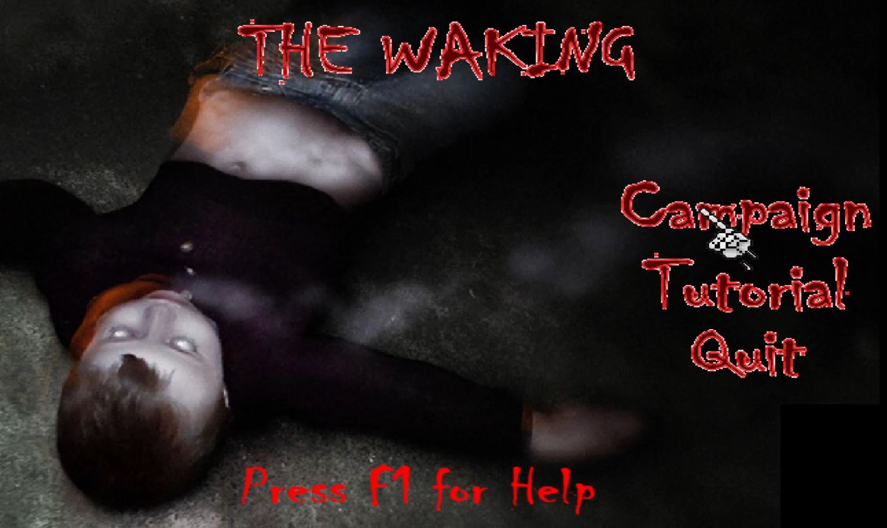

# The Waking - GameMaker 6.1

A 3D zombie shooter developed using Game Maker 6.1 in 2006 in collaboration with Adam Tee for a year 10 school IT project. The game consists of two levels with three cutscenes. The first level has the player escaping an office filled with zombies and then escaping the building. The second level requires the player get to a car to escape the zombies. We made up the name Razor Edge Studios as a studio name that was only used for this one project.
 
- ([Youtube Demo](https://youtu.be/5rIMB6ml8nU))

  
 
# Requirements to Open/Run/Compile

To open the chaos6_theone.gm6 you will need the registered version of Game Maker 6.1.  Note that Game Maker 6.1 may need to be patched to run on Windows 10 or higher as it was developed for Windows XP. You may need to relink all the other files in source if you want to run the project. This can be done by going to Gobal Game Settings, then Include, click Add and select all the files and delete all the others listed.

The copy in the executable folder is built with Game Maker to run on Windows 10.
 
# Credits

- Scripting: Peter Mitchell
- Resource Collector & Map Designer: Adam Tee

Other 3rd party materials used:
- Core 3d system by: John J.A.H. Weeren (aka "ThatGamesGuy")
- Reference ([tutorial](https://github.com/Squirrelbear/TheWaking-GameMaker6.1/blob/main/images/FPS.pdf)) by Mark Overmars (2004 version)
- Mosaic 3D importer by Zoltan Percsich

# Controls

- Exit: Escape
- Help: F1
- Foward: W
- Back: S
- Strafe Left: A
- Strafe Right: D
- Look around: Move mouse around
- Fire weapon: Left Click
- Change to Pistol: 1
- Change to SMG: 2
- Scroll through weapons: Roller in middle of mouse (up and down)
- Reload weapon: R
- Turn Flashlight ON/OFF: F
- Flip through Music Tracks: Numpad -/+
- Mute/Unmute Background Music: Backspace
- Spawn zombies: H

# Issues

A number of issues are present in the game that if you attempt it yourself you should be aware of.
- The audio level of the Razer Edge Studios chainsaw is significantly louder than it should be.
- Models have inverse normals compared to what they should be making the plants, table/chairs and cars all look strange.
- Sometimes cutscenes may not play if you are pressing any keys as they begin.
- When you die the game zooms in and stops working.
- When you finish the game successfully after the final cutscene it will also zoom in and stop working.
- The interface appears zoomed in on the first level for unknown reasons, but shows correctly on level 2.
- The controls are difficult to use because of the acceleration and halting when you collide with an object.